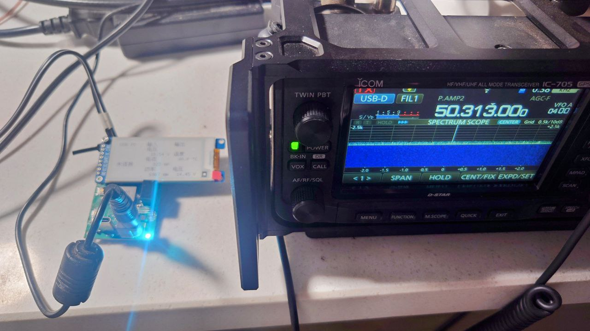
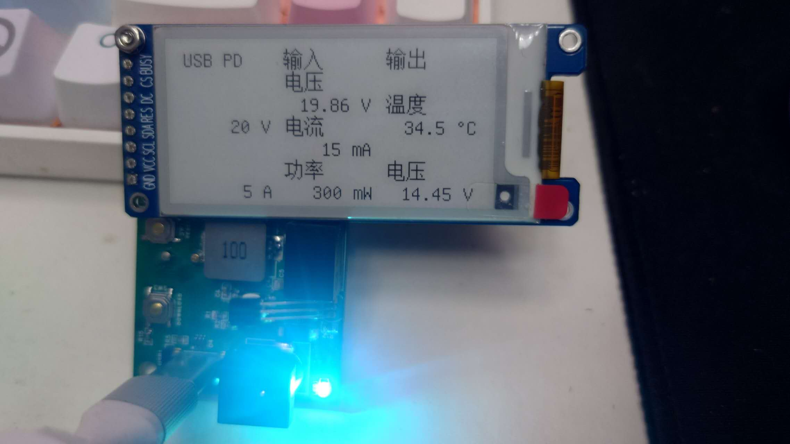
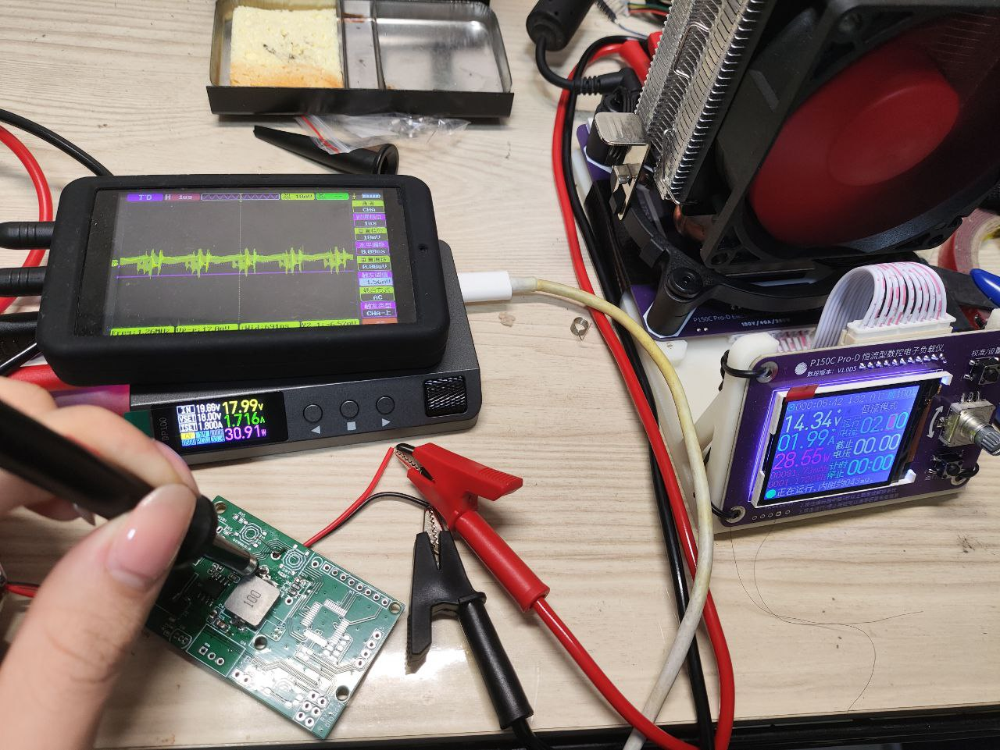
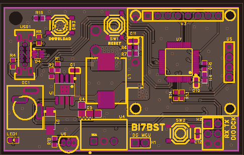
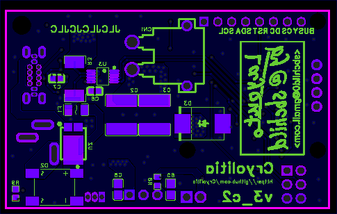
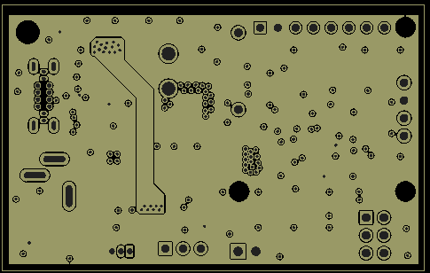
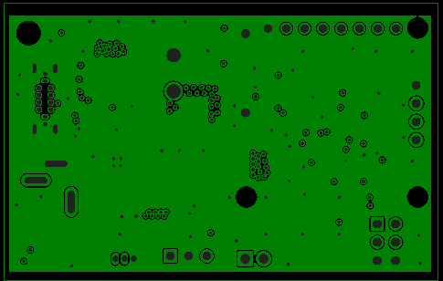

# 业余无线电手台供电板 8.4V/14.4V 5A

本项目是基于CH32X035和RT8289设计的降压电路，具有低纹波，自动协商USB Type-C供电协议，智能监测电压等特性的直流降压供电系统。设计用于无线电设备的固定以及移动供电，可与各类汽车电瓶、移动电源良好配合使用。

本人目前已长期将其搭配酷态科20号移动电源，用于ICOM IC-705手持台用于室内固定操作及野外操作，安全稳定，十分可靠。

立创开源硬件平台：<https://oshwhub.com/tony_23/radio_charger>

支持RISC-V谢谢喵~！

## 特点

- 宽电压输入，最高支持30V，建议不超过24V
- 低至10mV@1A的超低纹波
- 专为业余无线电设备设计的8.4V/13.8V电压输出
- 智能监测电压/功率/温度并实时显示
- 支持各类USB供电协议和DC直流输入
- 支持选配OLED屏幕或室外使用的墨水屏
- 直流输入正反任意盲插，输入防倒灌
- 高达5A的输出电流
- 安全可靠的XT-30输出接口

## 图片

